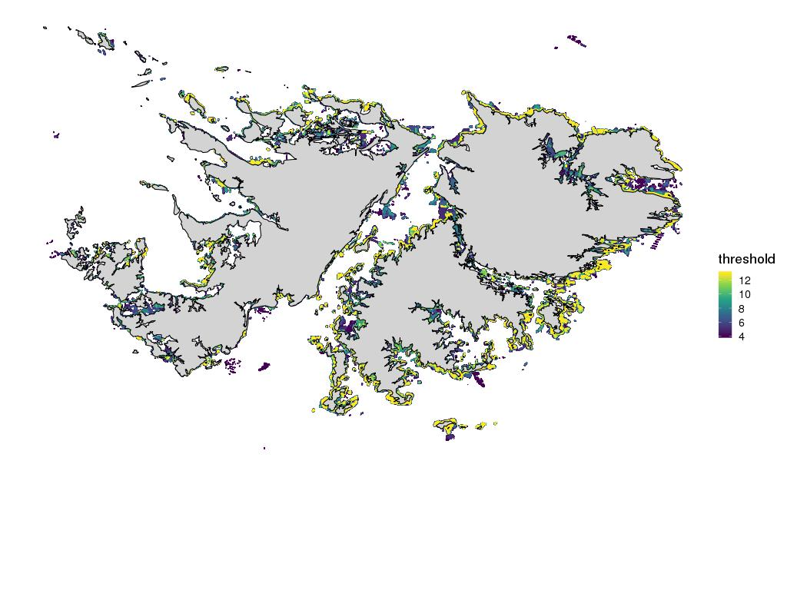

## Falklands  
- [Full map of forests in the Falklands with certainty thresholds](./images/all_kelp_zoomout.jpg)  
- [Full map of forests in the Falklands at threshold of 6 user agreement](./images/all_kelp_zoomout6.jpg)  
- [Full seasonal map of forests in the Falklands at threshold of 6 user agreement](./images/seasonal_panels.jpg)  

## California
- [Effect of thresholds on coastline kelp classifications gif](./images/threshold_polys_rast.gif)  
  
## Visualization of Thresholds and Validation
- [Example of consensus classification](./images/consensus_classification.jpg)